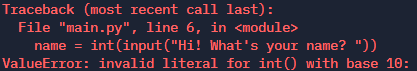
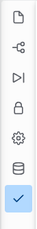
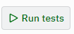

# Task Modify

This code is full of errors! 

Run the code. Oh my! That isn't good!

You will likely make the same mistakes in your own code, so it is worth learning what to look for when and how to fix it.

Debug is a process:
- Run the code
- Find an error
- Fix the error
- Repeat

The ValueError means that you are trying to use something incorrectly. It means either you are trying to treat a number like a string, or a string like a number. The line number tells you where you tried to use the value incorrectly. Often, but not always, the error is not on that line, but on the input line where you read the value as the wrong type.

Not all the errors cause a red error message! Pay attention to the output. Make sure all the math gives the results you expect.

Your task is to continuously modify the code until it works. Debug is a process of fixing one error, trying again, and fixing the next. **Do not delete any lines!** You must get the code working by modifying the lines, not removing them!

This is also the first problem that has a self test. Once you think you have the code working, click on the checkmark over on the left

Then click the Run tests button. 

## Help! My Code Doesn't Work!

Make sure that you check for the following things:

- You have put the parenthesis after the input command `()`
- You have typed the variable name **exactly** the same (including caps), every time
- There is a variable on the **left** of each assignment
- You have used a single **=** for assignment
- You have used the **+** symbol to concatenate (join).
- All of your indentation is correct.
- You concatenated numbers using `str(number)`
- You remembered to convert the `input` using `int()` or `float()`

